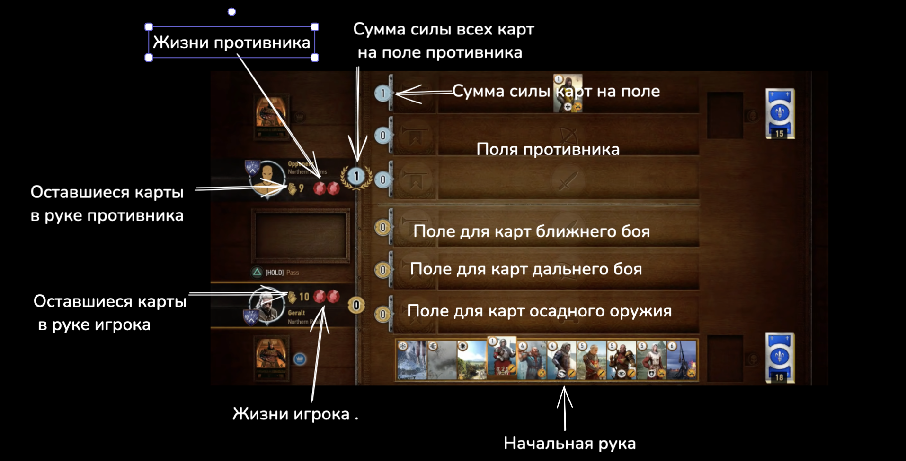
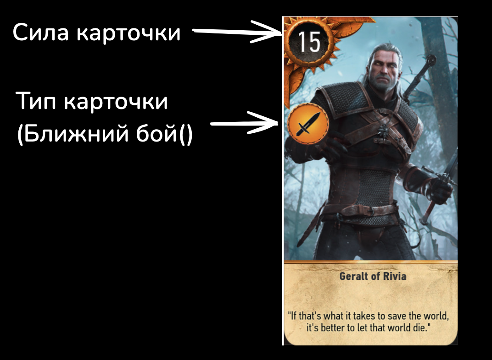
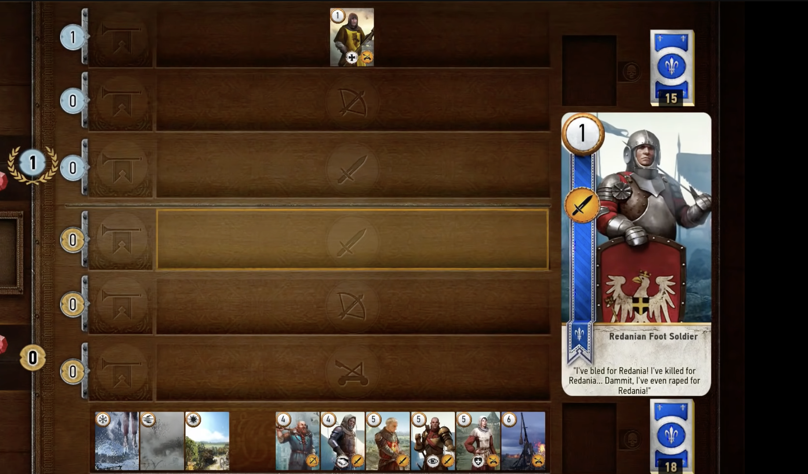
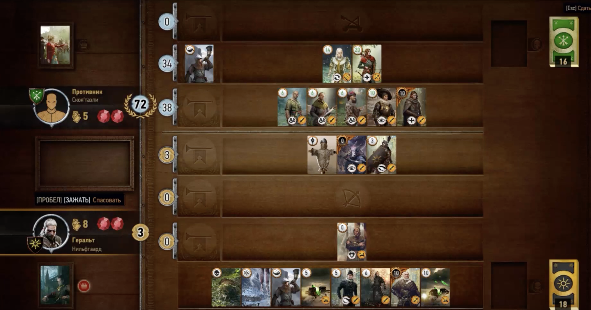
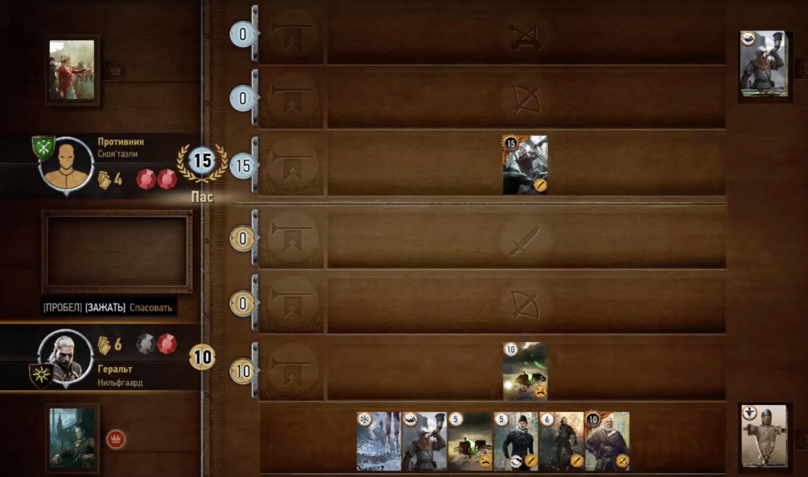
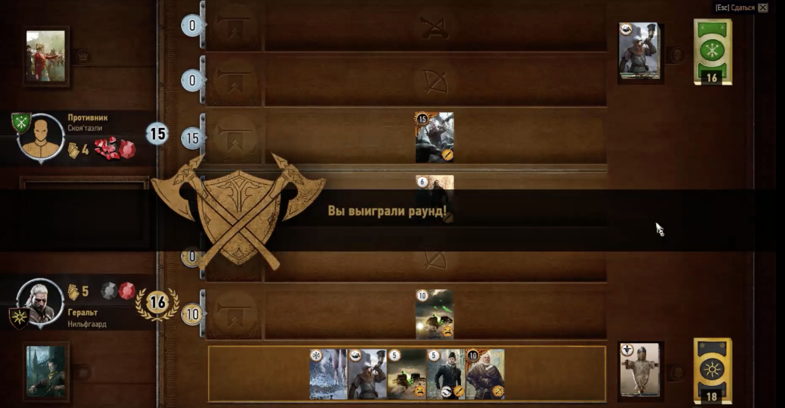

Гвинт — это карточная мини-игра. Цель игры — набрать больше очков, чем противник, используя различные карты. Игроки поочередно выкладывают карты, формируя свою боевую линию, пока не будет определен победитель.

## Основные Правила
1. **Колода**:
    - Колода должна содержать минимум 25 карт.
2. **Карты**:
    - **Карты юнитов**: Делятся на ближний бой, дальний бой и осадные машины.
      
1. **Раунды**:
    - Игра состоит из трех раундов. Победа в двух из трех раундов гарантирует общую победу в матче.
2. **Начальная Рука**:
    - Каждый игрок тянет по 10 карт в начале игры. Дополнительные карты можно получить только за счет специальных эффектов и способностей карт.
## Фазы Игры
1. **Выставление Карт**:
    - Игроки поочередно выкладывают карты на поле, стремясь набрать больше очков силы. При выборе карты подсвечивается поле в которое ее можно разместить.
      
2. **Переход Хода**:
    - Игроки могут пасовать, если считают, что набрали достаточное количество очков.
      
	На картинке выше противник набрал 72 очка и нет особого смысла пытаться его перегнать по очкам, лучше спасовать и сохранить карты на следующие раунды.
      
	Если противник спасовал, то мы можем выставлять карты на поле боя чтобы обогнать его по очкам или тоже спасовать.
3. **Конец Раунда**:
    - Раунд заканчивается, когда оба игрока пасуют или у них заканчиваются карты.
    - Победитель раунда определяется по наибольшему количеству очков на поле.
      
4. Конец игры:
  - Игра заканчивается когда один из игроков теряет две жизни.
  - Если раунд был закончен в ничью, т.е. противники имеют равное количество очков силы, то оба игрока теряет по одному очку жизни.

## Типы Карт
1. **Карты Юнитов**:
    - **Ближний Бой**: Карты, размещаемые в ближнем ряду.
    - **Дальний Бой**: Карты, размещаемые в среднем ряду.
    - **Осадные Машины**: Карты, размещаемые в дальнем ряду.
